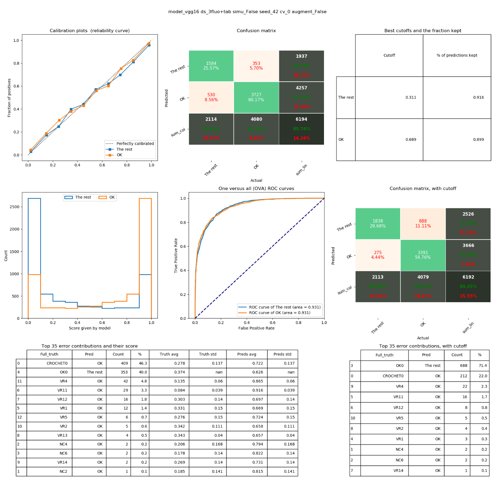

# SpectraTorch

SpectraTorch est un wrapper  fonctionnel de Pytorch-Lightning pour utilisation avec des données spectrales et tabulaires. 
Le cadre d’apprentissage automatique ici est PyTorch et peut autant fonctionner sur un ordinateur n’ayant pas de GPU, qu’un avec.
Il est hautement recommandé de faire l’apprentissage profond avec une carte graphique. 
Pour l’inférence, c’est moins important et peut être fait sur un ordinateur vieillot avec assez de RAM pour avoir les 
poids du modèle en mémoire (voir le projet mAPIe).
Le fichier Jupyter (voir plus bas) démontre les nettoyages effectués aux données reçues et le raisonnement derrière. 
Il démontre aussi comment convertir les données.
En trace d’exemples tous mes résultats les plus récents sont présents, comme leurs checkpoints.

Définitions pointues des classificateurs à prendre en note:
- AVA: All versus all pour la classification (multiclasse)
- OVA: One versus all pour la classification (binaire)
- IN: Classification par intensité.
- TY: Classification par type.
- TYs: Même chose que TY, mais sans les sous-types (ex, VR11, VR12…)
- INs: Même chose que IN, mais en combinant les OK avec les CROCHET.

## Format des noms de modèle

Voici un exemple de nom de modèle et comment comprendre les informations provenant de ce dernier.
> ResNetV2 y=['OVA', 'OK'] c=('277', '380', '425') t=('da',) 0-20 s=42 eps=0.1.onnx
- **ResNetV2**: Le type d’architecture
- **y=['OVA', 'OK']**: Les cibles définies pour ce modèle. Ici c’est OK vs Le reste. 
- **c=('277', '380', '425')**: Les channels utilisés ici. Dans ce cas, fluorescence seulement, pas de LSPR.
- **t=('da',)**: Les transformations appliquées aux données lors de l’entrainement (doivent donc être appliquées lors de l’inférence (sauf da)). Da est data augmentation.
- **0-20**: Le N-ième split d’un split des données. Ici c’est le premier split sur 20 (en python, une liste commence à 0)
- **s=42**: Le random seed utilisé pour le split des données.
- **eps=0.1**: Le epsilon utilisé pour le data smoothing (mélange des points pour générer des mélanges de différentes classes).


## Installation

### Pour GPU:
- S’assurer que les drivers de la carte graphique soient bien installés.
- Utiliser le fichier environment-cuda10.2.yml pour l'installation ci-bas.

###Pour CPU:
- Utiliser le fichier environment-cpu-only.yml pour l'installation ci-bas.

### Instructions après avoir choisi le processeur (CPU vs GPU)
- Télecharger le repository de spectratorch.
- Installer [miniconda](https://docs.conda.io/en/latest/miniconda.html)
- Écrire dans la console, **AVEC LE BON FICHIER ENVIRONMENT**:
```bash
conda env create environment-?????.yml
conda activate ml
cd path/to/spectratorch-repository
pip install -e .
```

## Génération du dataset dans le bon format

Les datasets (celui de 30k echantillons et celui de 300k) sont disponibles sous format .pkl dans le dossier datasets.
Toutefois, le processus de nettoyage est disponible et peut être reproduit avec ces instructions:

- Dans la console:
```console
conda install jupyter
jupyter-notebook
```
- Suivre les instructions dans le fichier Jupyter: **Exploratory analysis.ipynb**
  - Le code avance d’une cellule et cette cellule est executée à chaque fois que *Shift+Enter* est appuyé
  - Le code permet d’étudier les tendances du dataset et ensuite de le convertir au format que spectratorch a besoin.

## Comment utiliser le code:

- Dans la console:  
```console
cd projet\src
python train.py
```
  - Rajouter les arguments nécessaires après le train.py. 
  - Vous pouvez trouver les arguments possibles à la fin de train.py et datamodule.py.
  - **ATTENTION**: Pour objectif de présentation, à la ligne 193 de train.py des arguments ont été écrasés pour que le script fonctionne sans arguments.
  Veuillez les enlever ou les modifier pour faire votre propre apprentissage après le premier usage.

Si une erreur survient du type 
Il faut changer le nombre de GPU dans train.py du nombre prédéfini à 0. (Ligne 69) et la précision à 32.

Des transformations des données pertinentes aux données de fluorescence et LSPR sont disponibles à être ajoutées comme arguments. Elles sont présentes dans aceri_transforms.py pour voir ce qu’elles fonts.


## Visualisation de l’entrainement / résultats:

Tensorboard peut être utilisé pour visualiser les entrainements:
Dans la console:  
```console
tensorboard --logdir path/to/logdir
```

Une page web ouvrira pour vous montrer la direction des métriques de l’entrainement. 
C’est plus utile que le texte qui sort de la console lors de l’entrainement.


#### Figure 1: Example de chart tensorboard

Pour les résultats finaux contre le test_split. C’est un argument flag à ajouter lors de l’entrainement pour le produire avec le checkpoint.


#### Figure 2: Example de fiche de résultats.

[Voici une explication plus en détail des graphiques générés](doc/RESULTATS.md)

**Suggestions:**
- Utiliser des architectures de type VGG donne les meilleurs résultats par rapport au temps investi (VGG16 est très bon).
- Le batch normalisation aide substantiellement aux résultats, lorsqu’avec un petit batch_size.
- Il faut choisir une métrique de succès cohérente avec votre objectif stratégique.