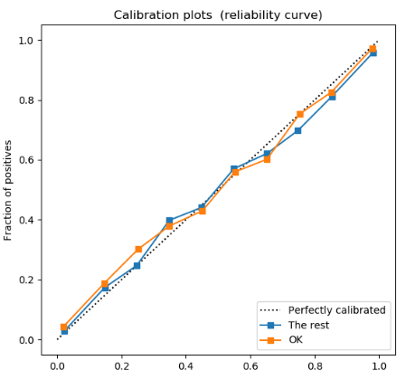
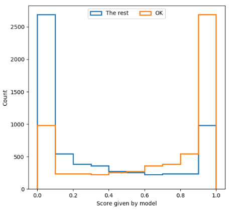
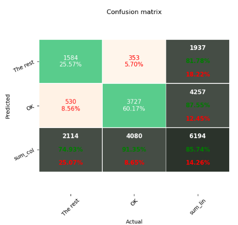
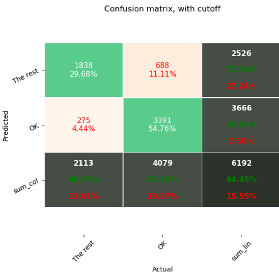
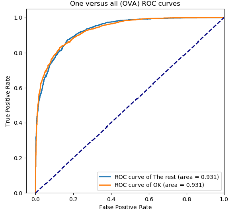
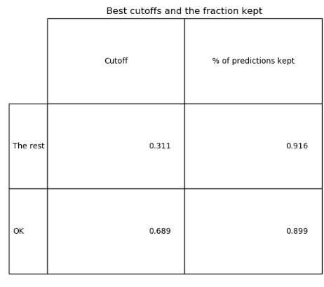
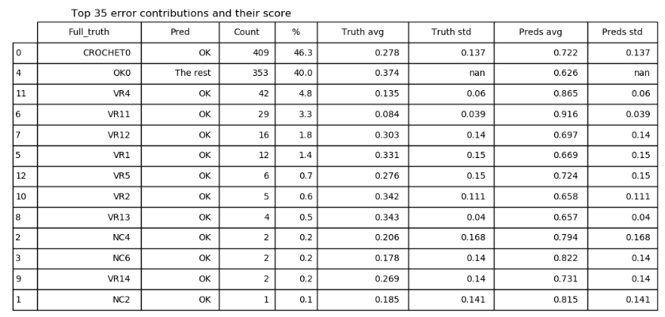
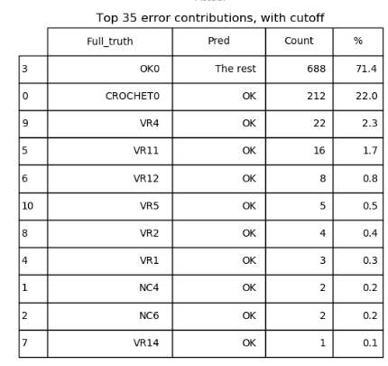

# Explication de l'utilité des graphiques dans la fiche de résultats

## Courbe de calibration

la courbe de calibration, en combinaison avec la distribution des scores, 
permet de déterminer l'utilité du modèle entrainé en situation de production (et non d'optimisation.)
Celle-ci permet de visualiser à quel pooint le score attribué à un échantillon représentate 
bel et bien la probabilité que ce soit un échantillon de la bonne catégorie.
Si les courbes suivent la diagonale, ceci signifie que le score représente bien ceci.

### Ok, pourquoi c'est utile en production?

Parce que on peu toujours augmenter la qualité des résultats obtenu d'un modèle en augmentant le cutoff/le score minimal
pour qu'un échantillon soit bel et bien classifié.
Si ce score représente bien la probabilité de vrai positif, 
on vient diminuer le nombre d'échantillon classifiés, mais on augmente la certitude des résultats.

En deep learning, ce n'est pas garanti que le score suivent bien la probabilité mentionnée ci-haut, 
c'est pourquoi ce graphique existe.

## Distribution des scores

Permet d'estimer rapidement ce que ferait un changement du cutoff.

## Matrices de confusion

### Sans ajustement du cutoff

### Avec ajustement du cutoff pour obtenir un recall de 92,5%

C'est des [matrices de confusion](https://en.wikipedia.org/wiki/Confusion_matrix). 
Celle avec le cutoff fixé à un recall de 92,5% permet d'utiliser le nombre déchantillon classifié comme métrique de qualité!
La valeur de 92,5% peut être changée dans le code dans le fichier result_plotting.py, méthode plot_roc_curve() !

## Courbe ROC pour le PR (precision-recall)

Cette courbe (et surtout son aire) est un outil pour quantifier la qualité d'un classificateur. 
Plus l'aire est proche de 1, plus c'est bon!

Le logiciel permet aussi de montrer la courbe ROC entre les vrais positifs et faux positifs (TP-FP).
Par contre la courbe ROC de PR est plus utile avec un classificateur de style AVA.

## Tableau de cutoff

Ce tableau représente les meilleurs cutoff trouvés automatiquement avec les PR curves. 
C'est donc le point où l'aire du rectangle qui rentre dans la ROC curve est la plus grande 
(meilleur compromis nombre d'échantillon traités / taux de vrai positif)

Pas toujours utile, car on peu considérer le recall beaucoup plus important que le pourcentage d'échantillon traité.

## Tableau des erreurs 

### Erreur du modèle sans cutoff

### Erreur du modèle avec cutoff à 92,5% de recall

C'est un tableau représentant la distribution des sirops incorrectement classifiés.

